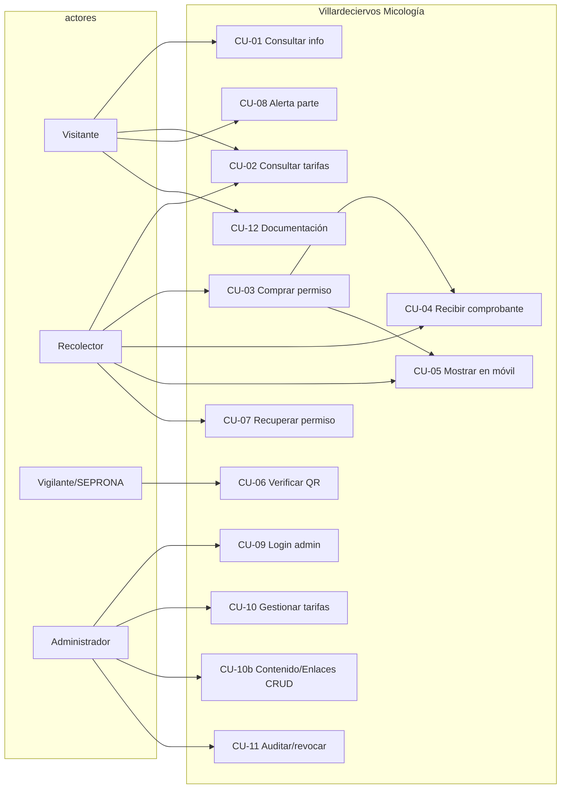

# Casos de uso

**Sistema:** Villardeciervos Micología  
**Versión:** 1.1

---

## 1. Catálogo de casos de uso

| ID | Nombre | Actor principal | Prioridad |
|----|--------|-----------------|-----------|
| CU-01 | Consultar información del coto | Visitante | Alta |
| CU-02 | Consultar tarifas | Visitante / Recolector | Alta |
| CU-03 | Comprar permiso digital | Recolector | Alta |
| CU-04 | Recibir comprobante (email/Telegram) | Recolector | Alta |
| CU-05 | Mostrar permiso en móvil | Recolector | Alta |
| CU-06 | Verificar permiso por QR | Vigilante / SEPRONA | Alta |
| CU-07 | Recuperar permiso por email | Recolector | Media |
| CU-08 | Activar alerta del parte | Visitante | Media |
| CU-09 | Autenticarse como administrador | Administrador | Alta |
| CU-10 | Gestionar tarifas | Administrador | Alta |
| CU-10b | Gestionar contenido y enlaces (CRUD) | Administrador | Alta |
| CU-11 | Auditar y revocar permisos | Administrador | Alta |
| CU-12 | Consultar documentación | Cualquiera | Media |

---

## 2. Especificaciones

### CU-03 Comprar permiso digital

- **Precondiciones:** Tarifas activas; conexión a internet.
- **Flujo principal:**
  1. El recolector abre `/comprar` y elige modalidad.
  2. Introduce nombre, email y DNI/NIE.
  3. El sistema valida formato y letra de control.
  4. Elige canales de entrega y acepta normativa.
  5. Confirma (pago simulado).
  6. El sistema emite permiso firmado, genera QR y lo persiste.
  7. Redirige a “Mi permiso”.
- **Flujos alternativos:**
  - DNI inválido → mensaje de error, no emite.
  - Rate limit → HTTP 429.
  - Fallo de email → se informa; el ticket web sigue disponible.
- **Postcondiciones:** Permiso `activo` almacenado; opcionalmente notificaciones enviadas.

### CU-06 Verificar permiso por QR

- **Precondiciones:** QR emitido; dispositivo con cámara/navegador.
- **Flujo principal:**
  1. El vigilante escanea el QR.
  2. Se abre `/verificar/[id]?sig=&t=`.
  3. La API valida firma, token, vigencia y estado.
  4. Se muestra resultado (válido / no válido / posible falsificación) y datos del titular enmascarados.
- **Postcondiciones:** Ningún cambio de estado (salvo consulta).

### CU-10 Gestionar tarifas

- **Precondiciones:** Sesión admin válida.
- **Flujo principal:**
  1. Admin entra en `/admin` → pestaña Tarifas.
  2. Modifica precios / kg / activación / notas.
  3. Guarda.
  4. La API pública `/api/tarifas` refleja los cambios.
- **Postcondiciones:** `data/tarifas.json` actualizado.

### CU-10b Gestionar contenido y enlaces

- **Precondiciones:** Sesión admin válida.
- **Flujo principal:**
  1. Admin abre `/admin` → pestaña Contenido / Enlaces.
  2. Edita hero, intro HTML, footer o WhatsApp.
  3. Crea, modifica, reordena, activa o elimina enlaces oficiales.
  4. Guarda → se persiste en `data/contenido.json`.
  5. La landing (`/api/contenido`) refleja los cambios.
- **Postcondiciones:** Contenido público actualizado; HTML sanitizado sin scripts.

### CU-11 Auditar y revocar permisos

- **Precondiciones:** Sesión admin; existen permisos.
- **Flujo principal:**
  1. Admin busca por texto.
  2. Revisa titular, email, código, estado.
  3. Opcionalmente revoca.
  4. Verificaciones posteriores marcan el permiso como no válido.

---

## 3. Diagrama de casos de uso (UML)

