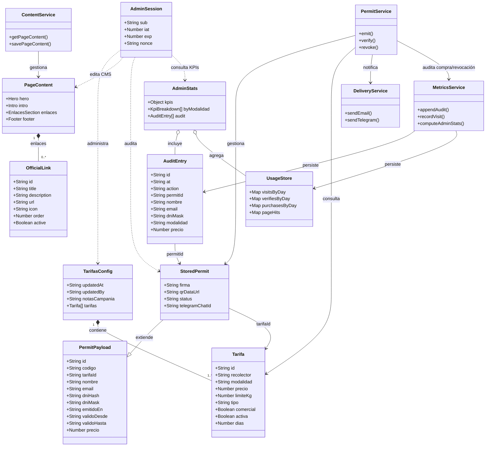
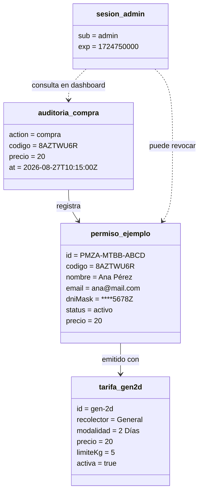
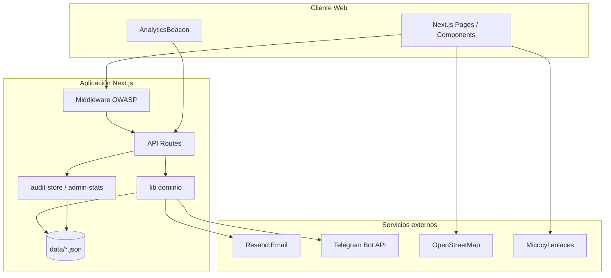
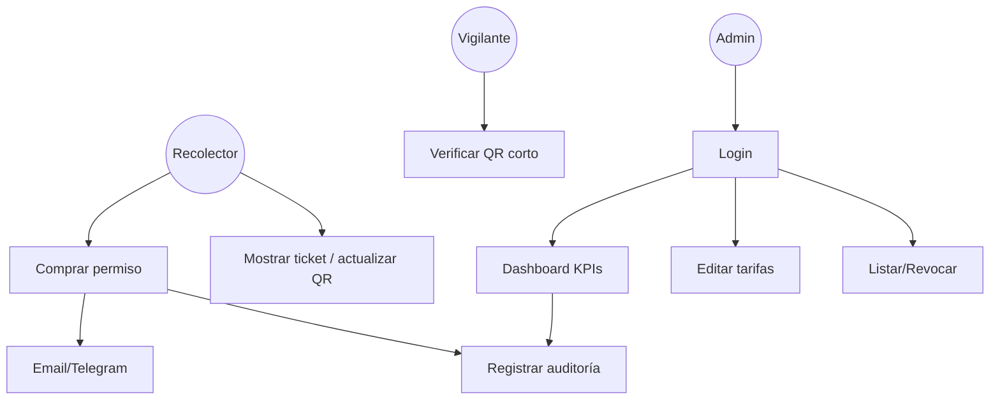
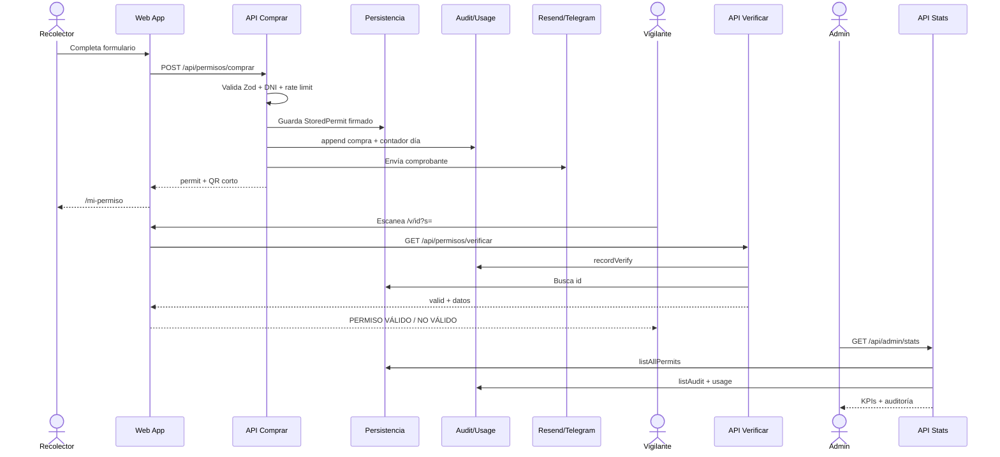
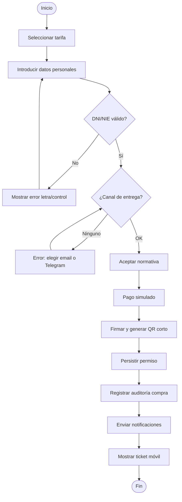
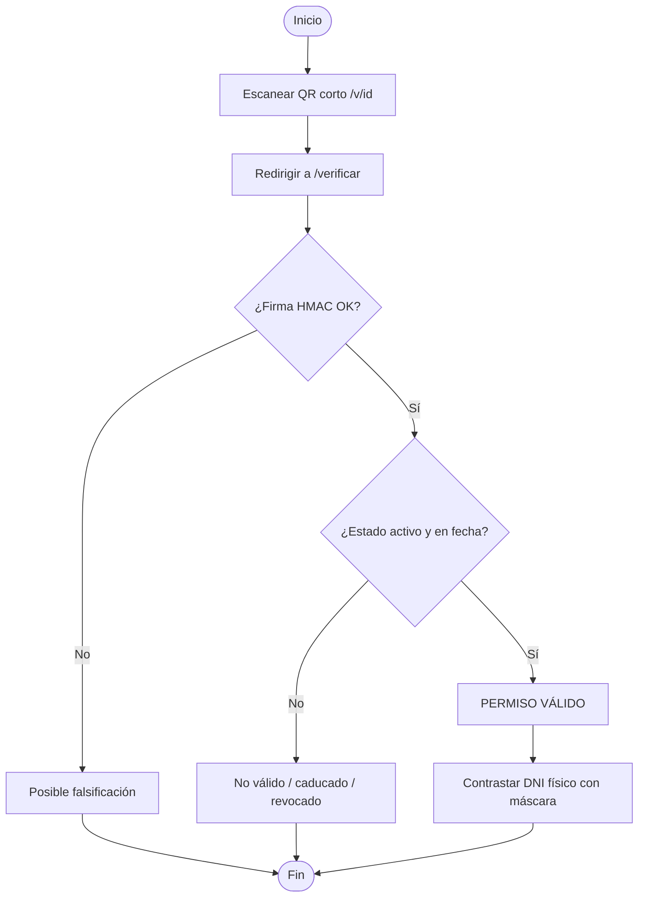
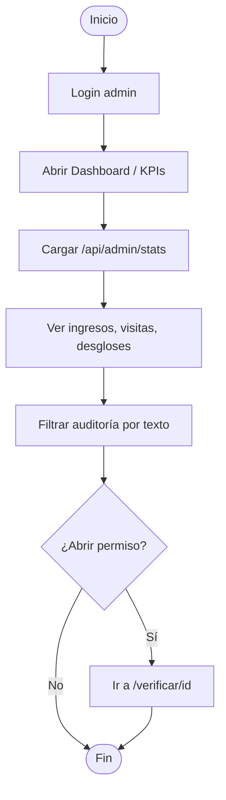

# Diagramas UML

**Sistema:** Villardeciervos Micología  
**Versión:** 1.2  
**Notación:** UML 2 (representación Mermaid compatible)

---

## 1. Diagrama de clases (estructural)

Muestra las principales entidades de dominio y sus relaciones.

---

## 2. Diagrama de objetos (estructural)

Instancia ejemplo tras una compra de “2 días general”.

---

## 3. Diagrama de componentes (estructural)

---

## 4. Diagrama de casos de uso (comportamiento)

Véase también `casos-de-uso.md`. Vista condensada:

---

## 5. Diagrama de secuencia — compra, auditoría y verificación (comportamiento)

---

## 6. Diagrama de actividades — emisión de permiso (comportamiento)

---

## 7. Diagrama de actividades — verificación por el vigilante

---

## 8. Diagrama de actividades — consulta de KPIs (admin)

